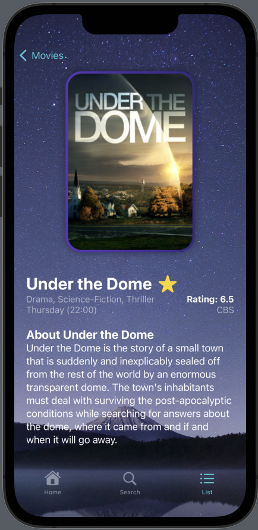

<h1 align="center">
Moviz Explorer
</h1>
Moviz Explorer is an application that allows users to explore a vast collection of movies using the TVMaze API. With three main features - Genre-based Movie Listing, Movie Search, and a comprehensive Movie List with favoriting capabilities - users can discover and manage their favorite movies easily.

<h2>Features</h2>

### 1. Genre-based Movie Listing
Browse movies based on different genres. Enjoy a curated selection of films that match your preferences.

### 2. Movie Search
Effortlessly search for movies using keywords. Find information about your favorite films quickly and efficiently.

### 3. Comprehensive Movie List
Access a complete list of all available movies. Mark your favorites and filter the list to view only your preferred films.

### 4. Favorites
Mark movies as your favorites for quick access. Use the "Show Favorites Only" toggle to filter the movie list and focus on your preferred selections.

### Getting Started
Clone the repository to your local machine.

```bash
git clone https://github.com/charlella/moviz.git
```

```bash
cd moviz
```
<h3>API</h3>
This application uses the TVMaze API to fetch movie data. You can access the API documentation here : https://www.tvmaze.com/api

<h2>Demo Video and Photos</h2>
Check out the demo video to see Moviz Explorer in action : https://youtu.be/LpIjVsz9rEM 

Here are pictures :
<br>





